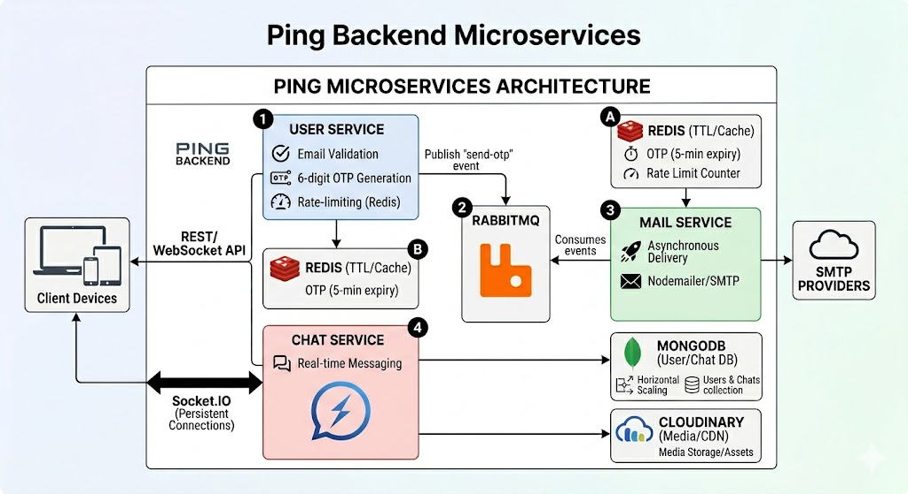

# **Ping – A Modern Microservices Chat Platform**

Ping is a scalable, real-time messaging platform designed with a high-performance **microservices architecture**, leveraging **TypeScript** across the entire stack to ensure robust type security. It features a stunning, responsive UI and focuses on speed, privacy, and seamless user experience.

---

## **Project Structure**

```bash
PING/
├── frontend/          # Next.js App Router, TailwindCSS, Socket.IO Client
└── backend/           # Microservices (Node.js, Express, TS)
    ├── user-service/  # Auth, OTP logic, Profile management
    ├── mail-service/  # Async email dispatch via RabbitMQ
    └── chat-service/  # Real-time messaging, Socket.IO server, Persistence
```

---

## **Architecture Overview**



Ping is built on the principle of **event-driven microservices** to ensure maximum scalability and fault tolerance.

- **Authentication Flow**: Uses Redis for ultra-fast OTP rate-limiting and temporary storage, while RabbitMQ handles asynchronous email delivery through the Mail Service.
- **Messaging Flow**: The Chat Service manages persistent connections via WebSockets (Socket.IO). Messages are stored in MongoDB and can be deleted for oneself or for all participants.
- **Real-time Engine**: Powered by Socket.IO with a modular structure to handle unread counts, seen status updates, and real-time "Online/Offline" presence.

---

## **Tech Stack**

### **Frontend**

- **Next.js (App Router)**
- **TypeScript**
- **TailwindCSS** (Custom Design System)
- **Lucide-React** (Iconography)
- **Socket.IO-client**
- **Axios** (API fetching)

### **Backend**

- **Node.js & TypeScript**
- **Express.js**
- **RabbitMQ** (Message Broker)
- **Redis** (Caching & TTL)
- **MongoDB** (Primary Database)
- **Cloudinary** (Image Storage)
- **Nodemailer** (Email Service)
- **Multer** (File Upload Middleware)
- **JWT** (JSON Web Tokens)

---

## **Getting Started & Deployment**

### **1. Prerequisites**

Ensure you have the following installed:

- Node.js (v18+)
- Docker & Docker Compose
- MongoDB (Atlas or local)

### **2. Setup Environment Variables**

Before running the containers, ensure you have the appropriate `.env` files set up in your subdirectories.
Refer to the README in each subdirectory for specific environment variable configurations:

- [Backend In-Detailed Design](./backend/README.md)
- [Frontend In-Detailed Design](./frontend/README.md)

### **3. Run with Docker Compose**

The entire Ping ecosystem (Frontend, User Service, Mail Service, Chat Service, Redis, RabbitMQ, and Local MongoDB) can be spun up using Docker Compose:

```bash
# Build and run all services in detached mode
docker-compose up --build -d
```

Once running, all the applications will be accessible.

To stop the services, simply run:
```bash
docker-compose down
```

---

## **Key Features**

- **OTP-based Verification**: Passwordless, secure login.
- **Micro-animation UI**: Designed for a premium, alive feel.
- **"Delete for both"**: Full control over your chat history.
- **Real-time Typing & Presence**: Native-feeling interaction.
- **Mobile Responsive**: Fully optimized for phones and tablets.

---

_Designed and Built by Astha._
